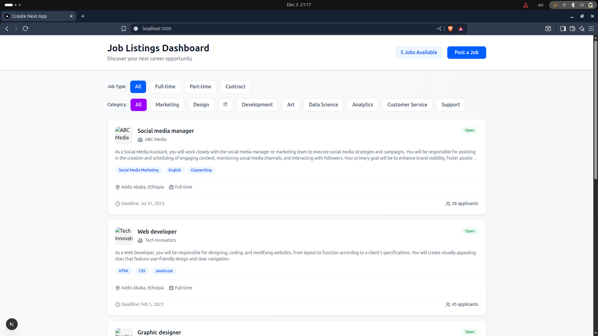
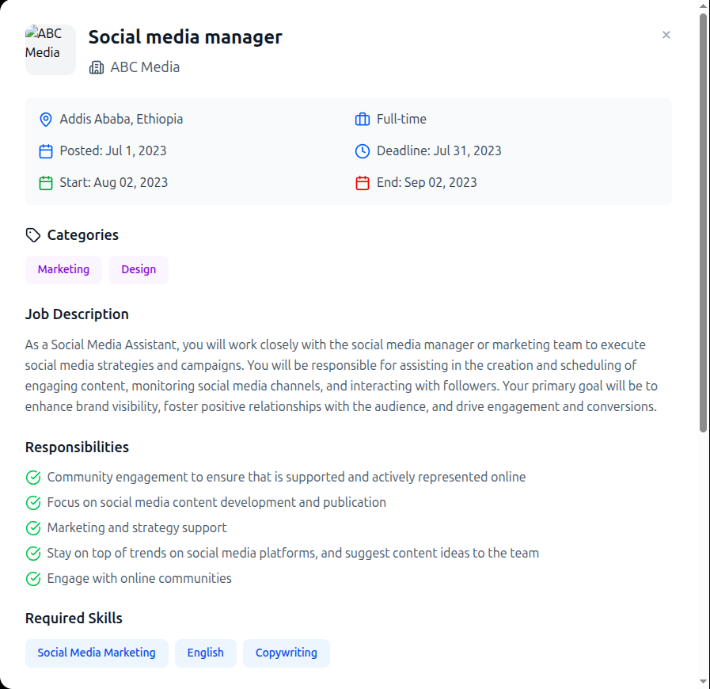

A modern job listing application built with Next.js, React, and Tailwind CSS.


## 📁 Project Structure

```
├── app/
│   └── page.tsx                          # Main page component (App Router)
├── components/
│   ├── JobCard.tsx                       # Individual job card component
│   ├── JobDetailModal.tsx                # Job detail modal component
│   ├── JobFilters.tsx                    # Filter controls component
│   ├── JobHeader.tsx                     # Header component
│   ├── EmptyState.tsx                    # Empty state component
│   └── Footer.tsx                        # Footer component
├── data/
│   └── jobs.ts                           # Job data array
├── types/
│   └── job.ts                            # TypeScript interfaces
├── screenshots/
│   ├── home.png                          # Home page screenshot
│   ├── details.png                       # Job details screenshot
│   ├── filters.png                       # Filters screenshot
│   └── empty.png                         # Empty state screenshot
└── README.md
```


## 📸 Screenshots

<div align="center">

### 🏠 Home Page

*Main dashboard displaying all job listings with filters*

---

### 📄 Job Details

*Detailed view of a job posting with full information*

Features
Browse job listings
View detailed job descriptions
Screenshots
Landing Page / Job List
Landing Page

Applicant Dashboard / Job Description
Job Description

Run
Clone or download this repository.

Install dependencies: npm install

Start the development server: npm run dev

Open your browser to the URL shown in the terminal (usually http://localhost:3000).


